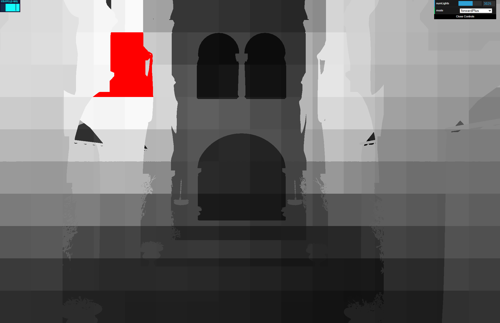
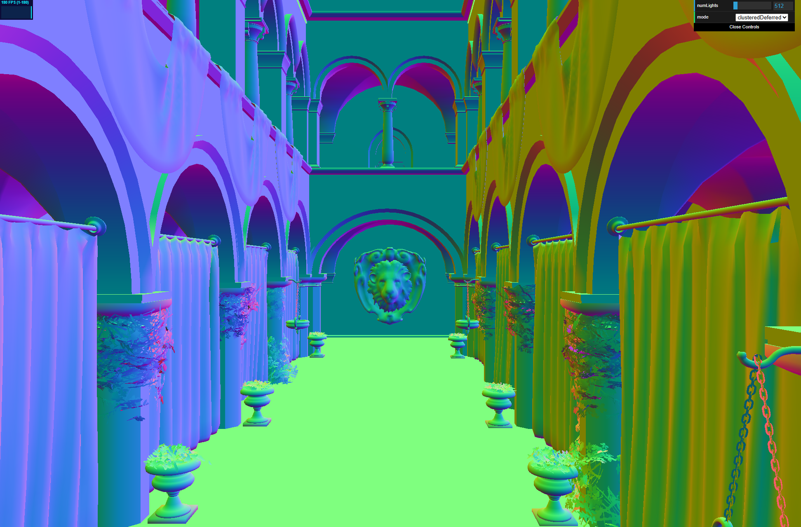
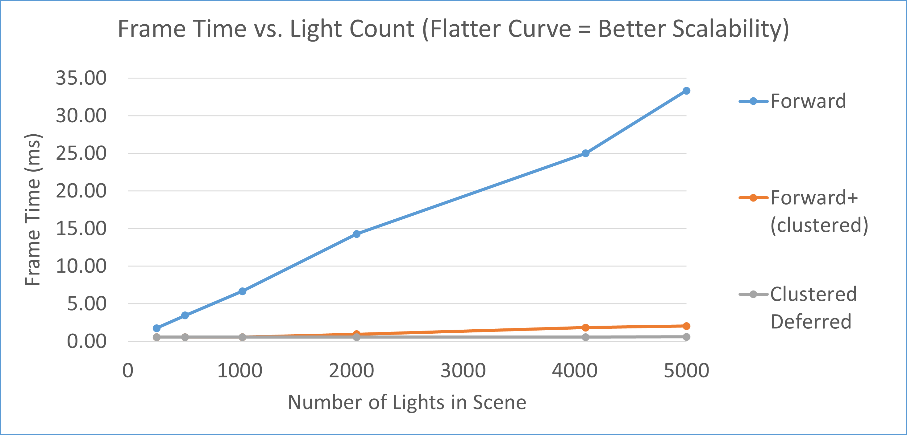

WebGL Forward+ and Clustered Deferred Shading
======================

**University of Pennsylvania, CIS 565: GPU Programming and Architecture, Project 4**

- Zhanbo Lin
    - [LinkedIn](https://www.linkedin.com/in/zhanbo-lin)
- Tested on: Windows 10, i5-10400F @ 2.90GHz 48GB, RTX-3080 10GB (Personal) 
- GPU Compute Capability: 8.6

### Live Demo
[WebGPU Renderer](https://skszb.github.io/Project4-WebGPU-Forward-Plus-and-Clustered-Deferred/)

### Demo Video/GIF

## Project Description
In this project I implemented three shading methods with WebGPU:
  - Naive Forward
  - Forward+
  - Clustered Deferred

### 1. Naive Forward
The traditional forward pipeline, loops through every light for every fragment and do shading.

### 2. Forward+
In forward+,  the view frustum is divided into into a 3D grid of clusters. Each cluster stores a list of lights that have influence within its volume. And each fragment within the cluster can consider only nearby lights during shading instead of all lights in the scene.

   Cluster ( From [Ángel Ortiz's Article](https://www.aortiz.me/2018/12/21/CG.html) )      |    Heatmap of # of Lights in Cluster ( brighter=more lights \| red=exceed limit and some are ignored in this cluster )
:----------------------------------------------:|:----------------------------------------------:
| 

The X and Y directions are sliced **uniformly in NDC space**, while the **Z direction is sliced logarithmically** to maintain better precision near the camera.  

   Z Direction Slicing ( From [Ángel Ortiz's Article]( https://www.aortiz.me/2018/12/21/CG.html ))      |    Logarithmic Z-slicing Visualization
:----------------------------------------------:|:----------------------------------------------:
| 

### 3. Clustered Deferred
The shading part is pretty much the same as the one in Forward+, but to a deferred pipeline, which do a gbuffer pass before the lighting computation and store information of visible objects.

G-buffers:
   Albedo      |   Normal
:-------------------------:|:-------------------------:
  | 

   Position      |   Depth
:-------------------------:|:-------------------------:
  | 

 

## Performance Analysis

All the tests were on Chrome with a resolution of \[1974 x 1279\]

As the plot shows, both **cluster-based rendering methods** achieve substantial performance improvements over the naïve forward pipeline.  
By limiting light evaluations to a small set of relevant lights per cluster, both **Forward+** and **Clustered Deferred** reduce redundant shading work and scale efficiently as light count increases.

### Forward+ vs. Clustered Deferred
In general, **Clustered Deferred** outperforms **Forward+**, especially in scenes with high overdraw because its G-buffer pass enables it to avoid shading computations on occluded surfaces.

However, deferred shading does not natively support rendering of transparent objects.

## Challenges
During implementation, I encountered several technical limitations of WebGPU, affected the design and structure of the renderer:

- **Bind Group Limitations**  
  WebGPU restricts the number of bind groups to a maximum of **4** per pipeline.  
  The global bind group ID constants defined in `shader.ts` can easily conflict when adding new resource groups.  
  Moreover, when defining pipeline layouts, bind groups must still be declared in strict order, so it becomes unclear how to manage or preserve bind group IDs cleanly across multiple shader stages.

- **Workgroup Size Restriction**  
  Each compute shader workgroup is limited to **256 threads**, which is lower than CUDA’s typical 1024-thread limit per block, and it seems like I cannot unlock it with extensions. Although it did not impact my implementation directly, I still wonder if smaller workgroup size could have effects on performance.

## Other Thoughts
I was advised to avoid **matrix multiplications inside the fragment shader**, as they can be relatively costly compared to vertex or compute stages. However, in practice, the frame rate does not drop much.

   Compute ndc in fragment shader      |   Compute ndc in vertex shader
:-------------------------:|:-------------------------:
  | 

### Credits

- [Vite](https://vitejs.dev/)
- [loaders.gl](https://loaders.gl/)
- [dat.GUI](https://github.com/dataarts/dat.gui)
- [stats.js](https://github.com/mrdoob/stats.js)
- [wgpu-matrix](https://github.com/greggman/wgpu-matrix)
